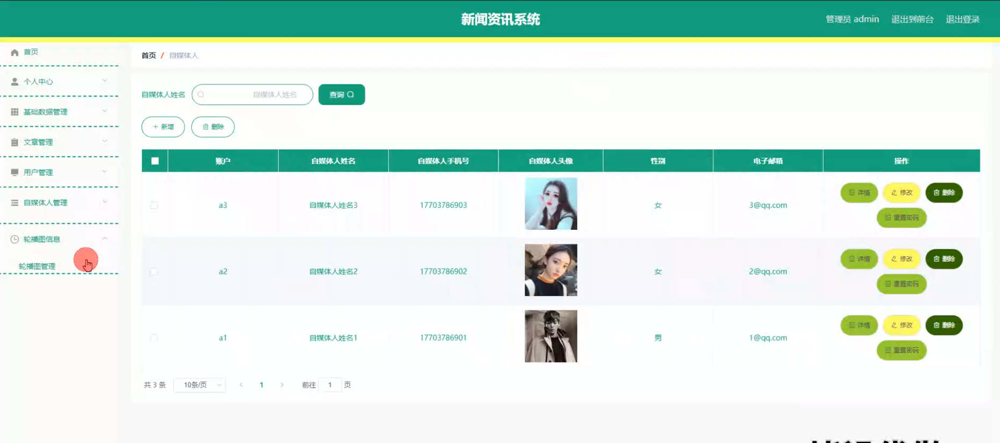

# 新闻资讯系统的毕业设计怎么写

#### 介绍

如何快速的完成毕业设计并顺利毕业呢？介绍一个使用springboot框架开发的新闻资讯系统；基于Spring Boot的新闻资讯系统旨在为用户提供便捷的新闻和资讯获取渠道，同时为自媒体人提供内容创作和发布的平台，并且为管理者提供系统管理和用户管理的功能。该系统设计了三种角色，分别是管理端、自媒体人端和用户端。每个角色都有相应的功能模块，确保系统的高效运转和良好的用户体验。

#### 研究背景

信息数据从传统到当代，是一直在变革当中，突如其来的互联网让传统的信息管理看到了革命性的曙光，因为传统信息管理从时效性，还是安全性，还是可操作性等各个方面来讲，遇到了互联网时代才发现能补上自古以来的短板，有效的提升管理的效率和业务水平。传统的管理模式，时间越久管理的内容越多，也需要更多的人来对数据进行整理，并且数据的汇总查询方面效率也是极其的低下，并且数据安全方面永远不会保证安全性能。结合数据内容管理的种种缺点，在互联网时代都可以得到有效的补充。结合先进的互联网技术，开发符合需求的软件，让数据内容管理不管是从录入的及时性，查看的及时性还是汇总分析的及时性，都能让正确率达到最高，管理更加的科学和便捷。本次开发的新闻资讯系统实现了字典管理、文章管理、文章收藏管理、文章留言管理、用户管理、自媒体人管理、管理员管理等功能。系统用到了关系型数据库中王者MySql作为系统的数据库，有效的对数据进行安全的存储，有效的备份，对数据可靠性方面得到了保证。并且程序也具备程序需求的所有功能，使得操作性还是安全性都大大提高，让新闻资讯系统更能从理念走到现实，确确实实的让人们提升信息处理效率。

#### 技术栈

后端技术栈：Springboot+Mysql+Maven

前端技术栈：Vue+Html+Css+Javascript+ElementUI

开发工具：Idea+Vscode+Navicate

#### 系统功能介绍

管理端功能模块  
个人中心：管理个人信息，修改密码，查看通知和系统消息。  
基础数据管理：管理系统基础数据，包括分类、标签、轮播图等信息，确保数据的准确性和完整性。  
用户管理：查看和管理系统注册用户，分配用户权限，确保系统安全性，添加、编辑、删除用户信息。  
自媒体人管理：审核自媒体人注册申请，管理自媒体人信息，分配和调整自媒体人的权限。  
轮播图信息管理：添加、编辑、删除轮播图信息，管理轮播图的展示顺序和内容。  

自媒体人端功能模块  
文章模块：创建和编辑文章，支持富文本编辑，添加文章的分类和标签，提高文章的搜索和展示效果。  
个人中心：管理个人信息，修改密码，查看个人发布的文章和系统通知。  
后台管理中的文章管理：查看和管理已发布的文章，编辑和删除文章，查看文章的浏览量和评论情况。  

用户端功能模块  
文章模块：浏览和搜索文章，支持按分类和标签筛选，查看文章详情，发表评论和点赞。  
个人中心：管理个人信息，修改密码，查看个人收藏的文章和浏览历史。    
后台管理中的文章管理：查看个人发布的文章（如果有权限发布），编辑和删除个人发布的文章。  

#### 系统模块设计

新闻资讯系统系统在进行系统中功能模块的划分时，采用层次图来进行表示。层次图具有树形结构，它能使用矩形框来描绘数据信息。顶层代表的数据结构很完整，顶层下面的矩形框表示的数据就是子集数据，当然处于最下面的矩形框就是不能再进行细分的数据元素了，使用层次方框图描述系统功能能让用户一目了然，能够明白系统的功能，以及对应功能板块下面的子功能都可以清楚领会。新闻资讯系统分为管理员和用户两部分操作角色，下面将对他们的功能进行阐述。

#### 系统流程分析

新闻资讯系统的开发也是有对应的流程，开发之前必须要进行用户功能需求的分析，最后根据功能需求进行网站设计还有数据库相关数据的设计工作，此次开发的新闻资讯系统开发流程如下：

系统开发完成之后会给用户提供登录入口，在这个界面用户输入的信息会得到验证，通过验证之后才能进去新闻资讯系统的访问主界面，系统登录执行流程如下：

#### 系统作用

信息获取：用户可以方便地获取最新的新闻和资讯，满足其信息需求。  
内容创作：自媒体人可以在平台上创作和发布文章，提升其个人影响力和内容传播力。  
系统管理：管理端可以有效地管理系统用户和自媒体人，维护系统的正常运转和信息的真实性。  
互动平台：提供评论和点赞功能，增强用户和自媒体人之间的互动，提高用户粘性。  

#### 系统功能截图

登录

前台页面首页

文章模块

管理员端基础数据管理

文章管理

用户管理

自媒体人管理

自媒体人端后台管理

用户端后台管理

#### 总结

本新闻资讯系统在满足用户获取信息需求的同时，也为自媒体人提供了一个内容创作和发布的平台，并且通过管理端的有效管理，确保了系统的安全性和信息的真实性。该系统的设计和开发不仅填补了现有自媒体平台功能单一的空白，也为未来的自媒体平台发展提供了新的思路和方向。通过不断优化和升级，本系统有望在新媒体领域中发挥更大的作用和影响力。

#### 使用说明

创建数据库，执行数据库脚本 修改jdbc数据库连接参数 下载安装maven依赖jar 启动idea中的springboot项目

前台登录页面
http://localhost:8080/xinwenzixunxitong/front/index.html

后台登录页面
http://localhost:8080/xinwenzixunxitong/admin/dist/index.html

管理员				账户:admin 		密码：admin

用户				账户:a1 		密码：123456

自媒体人				账户:a1 		密码：123456

